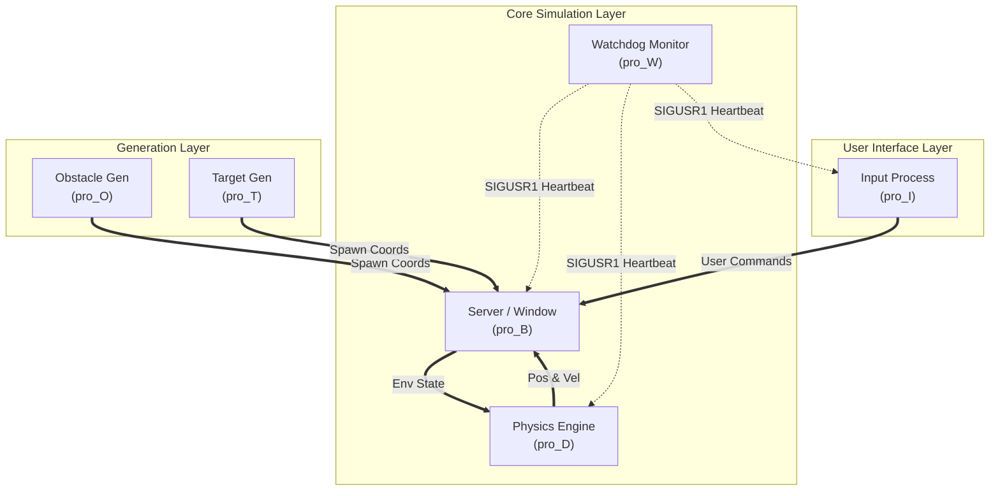
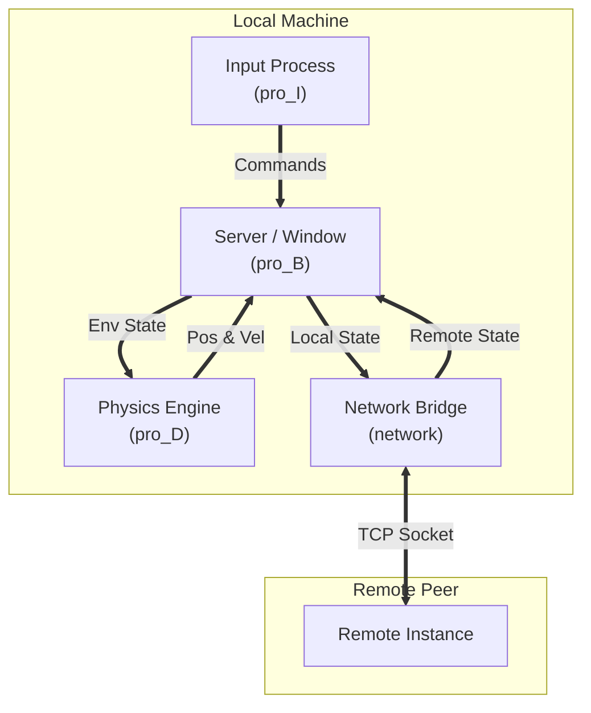
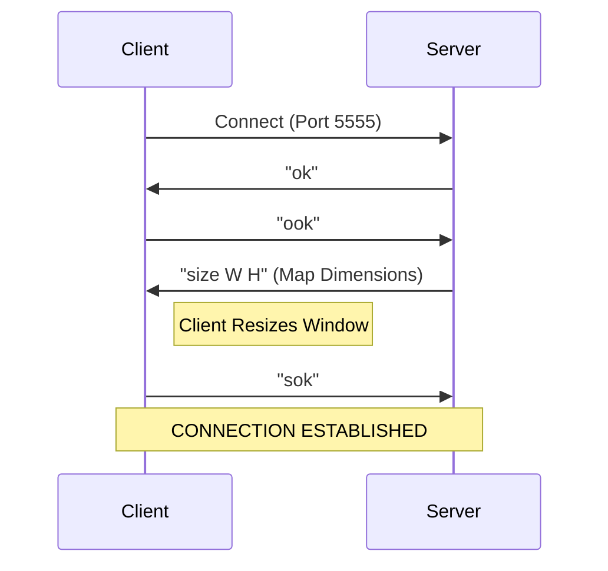

# Drone Simulation System - Engineering Report

**Date:** January 18, 2026
**Project:** Advanced Real-time Programming (ARP) - Assignments 1-3
**Author:** Belal Elmikkawy
**Architecture:** Multi-process Blackboard System with Network Bridge

---

## 1. Abstract

This project implements a real-time, multi-process drone simulation system designed to demonstrate robust inter-process communication (IPC) and network synchronization. The system evolves from a basic physics simulator to a fully networked multiplayer environment. It utilizes a centralized Blackboard architecture where a Master process orchestrates subsidiary processes (Input, Physics, Obstacle Generation) via non-blocking pipes. The final iteration features a TCP/IP Network Bridge that enables seamless cross-device compatibility, lag compensation via rate limiting, and dynamic resolution scaling.

---

## 2. System Architecture

The core design follows a **Blackboard Pattern**. The Server (Master) process acts as the Blackboard, maintaining the authoritative world state and rendering the user interface (ncurses). All other modules operate as independent processes, communicating solely with the Master via unidirectional pipes.

### 2.1 Process Diagram (Standalone Mode)

In **Standalone Mode**, the system spawns local generators for detailed environmental simulation.



### 2.2 Process Diagram (Network Mode)

In **Network Mode**, the generators and Watchdog are disabled to focus on PvP interaction. A **Network Bridge** is introduced.



---

## 3. Network Protocol (Assignment 3)

The networking module was designed for high compatibility and low latency.

### 3.1 Handshake Flow



### 3.2 Lag Compensation
Data synchronization (position updates) uses two key optimization techniques:
*   **Rate Limiting (TX):** Transmissions are capped at 30Hz to prevent bufferbloat and network congestion.
*   **Packet Coalescing (RX):** The receiver processes the entire input buffer at once and applies only the *latest* state, discarding obsolete intermediate frames. This eliminates "catch-up" lag.

### 3.3 Compatibility Layer
The system includes a **Protocol Agnostic Parser** and **Strict Emitter**:
*   **RX:** Can parse both strictly tagged packets (`drone x y`) and raw coordinates (`x y`).
*   **TX:** Always emits tagged packets to ensure compatibility with strict third-party implementations.

---

## 4. Implementation Details

The project is structured modularly. Each component resides in its own source file within `src/`.

*   **`src/server/pro_B.c`**: Implements the main `select()` multi-plexing loop.
*   **`src/drone/pro_D.c`**: Implements the Euler integration for physics.
*   **`src/network/network.c`**: Implements the non-blocking socket logic.

All logs are written to specific files (`network.log`, `drone.log`, etc.) to facilitate debugging without polluting the main game UI.

---

## 5. Execution Instructions

The project utilizes **CMake** for build automation. A unified script `run.sh` is provided to handle the entire lifecycle (Clean -> Configure -> Build -> Run).

### 5.1 One-Command Launch

To start the system, simply execute:

```bash
./run.sh
```

**This single command will:**
1.  Clean previous build artifacts.
2.  Regenerate the build system using `cmake`.
3.  Compile all binaries (`server`, `drone`, `network`, etc.).
4.  Launch the Master Server.

### 5.2 Operating Modes

Upon launch, the system prompts for a mode:
*   **1. Server:** Hosts a game session on Port 5555. Waits indefinitely for a client.
*   **2. Client:** Joins an existing server. Requires the Server's IP.
*   **3. Local:** Runs a single-player simulation with randomly generated obstacles.

---

## 6. Detailed File Structure

```
├── run.sh                      # MASTER SCRIPT: Builds and Runs the project
├── CMakeLists.txt              # Build Configuration
├── src/
│   ├── server/pro_B.c          # Core Logic & UI
│   ├── network/network.c       # TCP/IP Communication
│   ├── drone/pro_D.c           # Physics & Dynamics
│   ├── input/pro_I.c           # Keyboard Input
│   ├── obstacle/pro_O.c        # Obstacles
│   ├── target/pro_T.c          # Scoring Targets
│   └── watchdog/pro_W.c        # Process Monitor
├── include/
│   └── common.h                # Protocol Definitions
└── README.md                   # This Report
```

---

## 7. Known Issues & Troubleshooting

*   **Firewall:** Ensure Port 5555 is allowed through the firewall.
*   **Connection Timeout:** If the client fails to connect, ensure the Server is running first. The Server will log "Listening on Port 5555" to `network.log` when ready.
*   **Log Files:** If the UI seems frozen, check `watchdog.log` or `network.log` in the project root for error messages.
